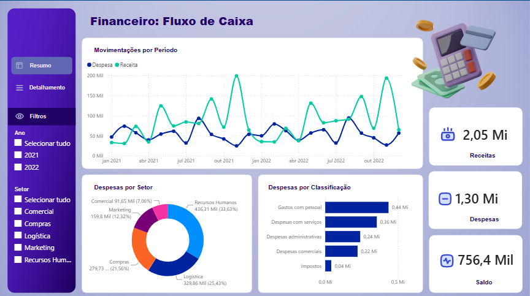

Dashboard Financeiro - Fluxo de Caixa

Projeto de Business Intelligence desenvolvido em **Power BI** com o objetivo de analisar a movimentação financeira de uma empresa, permitindo acompanhar receitas, despesas, saldo e a distribuição dos gastos ao longo do período.

## Objetivo do Projeto

O objetivo deste projeto é aplicar conceitos de análise de dados e Business Intelligence na construção de um dashboard financeiro interativo, facilitando a visualização dos principais indicadores de fluxo de caixa e apoiando a análise das movimentações financeiras.

## Principais Indicadores

O dashboard apresenta indicadores como:

- **Receitas:** R$ 2,05 milhões
  **Despesas:** R$ 1,30 milhão
- **Saldo:** R$ 756,4 mil
- Movimentação de receitas e despesas por período
- Distribuição das despesas por setor
- Classificação das despesas
- Análise por ano e setor

## Análises disponíveis

O relatório permite analisar a evolução das **receitas e despesas ao longo do tempo**, além de identificar quais setores e classificações possuem maior participação nas despesas.

Também foram adicionados filtros que permitem segmentar as informações por:

- Ano
- Setor

Isso possibilita explorar diferentes cenários financeiros de forma interativa.

## Tecnologias Utilizadas

- **Power BI** - desenvolvimento do dashboard e visualizações
- **Power Query** - preparação e transformação dos dados
- **DAX** - criação de medidas e indicadores
- **Excel** - fonte de dados do projeto

## Alguns Insights do Dashboard

A partir da visualização dos dados, é possível observar:

- As receitas apresentam variações significativas durante o período analisado.
- O setor de **Recursos Humanos** apresenta a maior participação nas despesas por setor.
- **Gastos com pessoal** representam a principal classificação de despesas.
- O resultado consolidado apresenta saldo positivo no período analisado.

## Arquivos do Projeto

- `fluxodecaixa.pbix` - arquivo do projeto desenvolvido no Power BI
- `dashboard-fluxo-caixa.png` - visualização do dashboard

## Sobre o Projeto

Este projeto faz parte do meu portfólio de estudos em **Análise de Dados e Business Intelligence**, no qual venho desenvolvendo conhecimentos em SQL, Power BI, Excel, Python e Banco de Dados.

O objetivo é aplicar esses conhecimentos na resolução de problemas e na transformação de dados em informações que possam auxiliar na tomada de decisões.

## Autor

**Ítalo da Silva Vieira**

Estudante de Análise e Desenvolvimento de Sistemas, com foco em Análise de Dados e Business Intelligence.
